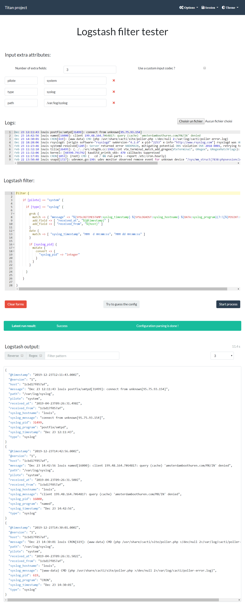

[](https://sonarcloud.io/dashboard?id=org.psa%3Atitan-project) 

# Titan project

An attempt to make a **web interface** to facilitate development of **Logstash configuration files**

---

Current instance is located here :

> https://titan-project.transrian.fr

---



## Installation

### Docker

> Windows is not supported at that time, use the Vagrant part into developpement if you're still willing to use it

The **easier way to deploy** this application is via the [docker-compose](docker-compose.yml) file associated with this project.

You will need to install :
- [Docker](https://www.docker.com/)
- [Docker compose](https://docs.docker.com/compose/)
    - **Current user should have full docker access (eg. `docker ps` should work**)
    - **Currently only work with Docker Unix socket**

Then, build the Logstash images :

```bash
cd titan-project/logstash
docker-compose build
```

> You can customize the image to set-up by modifying the file [logstash/docker-compose.yml](logstash/docker-compose.yml)

And then deploy the web part !

```bash
cd titan-project/
docker-compose up -d
```

**Application** will then be available at http://localhost:8080/

## Development

If you want to participate to this project, you can use the [Vagrantfile](Vagrantfile) present in this project.

You will need to install :
- [Vagrant](https://www.vagrantup.com/)
- [VirtualBox](https://www.virtualbox.org/)

If you are beyond a proxy, you need to have the [Vagrant plugin proxy-conf](https://github.com/tmatilai/vagrant-proxyconf) installed

Once done, go into a command-line and launch the VM:

```bash
# Create and boot the machine
vagrant up

# Connect to the machine
vagrant ssh

# Build the Logstash images
cd /vagrant/logstash
docker-compose build

# Go into the backend directory
cd /vagrant/backend

# Install npm requirements
npm install

# Run the backend
npm run nodemon
```

You will then have the access to :
- The **frontend** at http://localhost:8080
- The **backend** at http://localhost:8081

## F.A.Q.

### Why this project ?

In our team, we're all working some part of our time on doing Logstash configuration stuff. 
But fact is that conceive a Logstash configuration file may be pretty hard & annoying, and require to have some Logstash instances dedicated. And newcomers need to learn how to build filter from Scratch.

So I made this little prototype, that we now use in prod for more than 6 month. It's not some great code, but it just work :)

It permit up to speed-up our developement process by more than 5x time, and wouldn't know where to start again without it.

### Are my data safe ?

First of all, you should **never assume your data are safe on the internet**. You've been warn.
Then, I put some effort to minimise security problems, by isolating each process into one container, that contains (only) user data. All configuration files (input log, configuration, etc.) is deleted after the job is done.
If you found a security issues, please contact me at *valentin.bourdier at mail.com*, so we can fix that ASAP.

## Contributing

All contributions are welcome: ideas, patches, documentation, bug reports,
complaints, and even something you drew up on a napkin.

Programming is not a required skill. Whatever you've seen about open source and
maintainers or community members  saying "send patches or die" - you will not
see that here.

It is more important to me that you are able to contribute.
